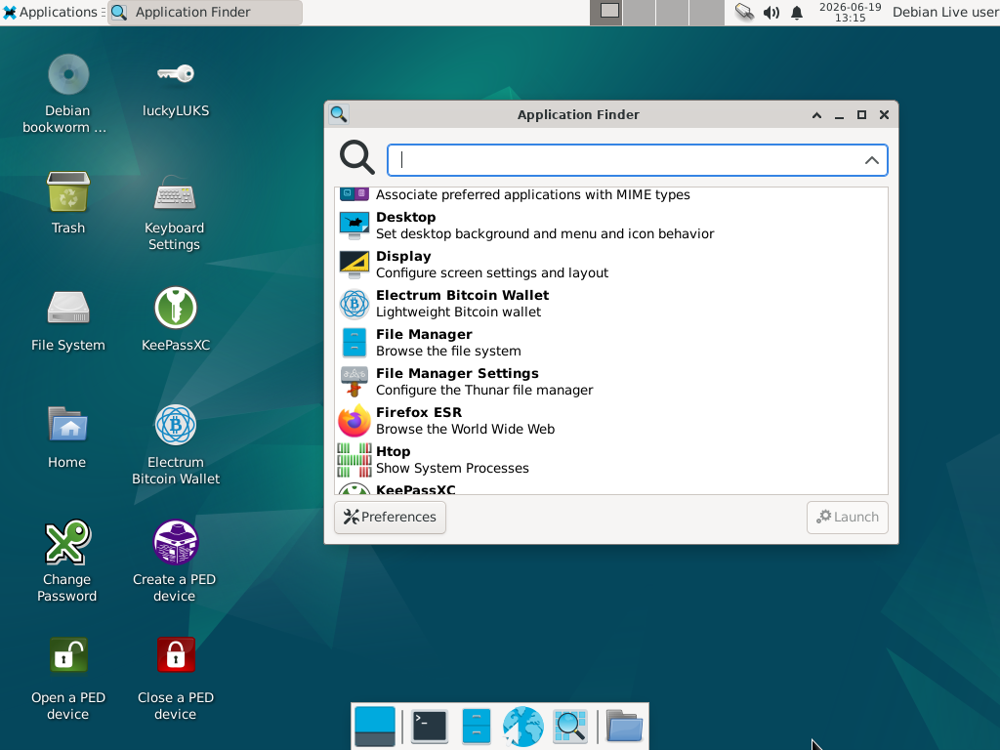

# TraceLess: A Privacy-Focused Operating System That Leaves No Trace

## Overview

There are situations where sensitive data must be handled without leaving recoverable traces on a computer.

Consider the following example:

You need to prepare files for cloud storage. Before uploading them, you encrypt the files locally. Even if the original files are later deleted, remnants may remain on the storage device and could potentially be recovered through forensic analysis. This becomes a concern if the computer is compromised, stolen, sold, or discarded without proper sanitization.

In such scenarios, a safer approach is to work from an operating system that never writes data to persistent storage. Ideally, the system should run entirely in memory while providing all the tools required for encryption, secure communications, and privacy-oriented workflows.

This project demonstrates how to build a customized Debian-based operating system designed to run entirely from a read-only USB drive.

### Key Features

* Runs entirely in RAM.
* Does not require mounting a hard drive.
* Designed for privacy-sensitive operations.
* Includes a curated set of security and productivity tools.

### Included Software

* [KeePassXC](https://keepassxc.org/) – Password manager.
* [Cryptsetup](https://gitlab.com/cryptsetup/cryptsetup) – Disk and container encryption utility based on LUKS.
* [GnuPG](https://www.gnupg.org/) – OpenPGP implementation.
* [Luckyluks](https://github.com/jas-per/luckyLUKS): A Linux GUI for creating and (un-)locking encrypted volumes from container files.
* [Age](https://github.com/filosottile/age) – Modern, simple, and secure file encryption tool.
* [OpenSSL](https://www.openssl.org/) – Cryptographic toolkit and SSL/TLS implementation.
* [OpenSSH Client](https://www.openssh.org/) – Secure remote access and file transfer tools.
* [Proton VPN](https://protonvpn.com/) – Privacy-focused VPN service.
* [Firefox ESR](https://www.mozilla.org/firefox/) – Extended Support Release of the Firefox web browser.
* [LibreOffice Writer](https://www.libreoffice.org/) – Open-source word processor.
* [Electrum](https://electrum.org/): Open-source Bitcoin wallet that supports the lightning network.

### Added Features

<table style="padding:10px">
   <tr>
      <td>
         
      </td>
      <td>
         Create a PED device.
      </td>
   </tr>

   <tr>
      <td>
         
      </td>
      <td>
         Open a PED device.
      </td>
   </tr>

   <tr>
      <td>
         
      </td>
      <td>
         Close a PED device.
      </td>
   </tr>

   <tr>
      <td>
         
      </td>
      <td>
         Change the user's password.
      </td>
   </tr>      
</table>


## Building the ISO Image

To simplify the build process, the project includes a Docker environment containing all required dependencies.

### Build the Docker Image

```bash
docker build -t debian-trixie -f docker/Dockerfile docker
```

### Generate the ISO

1. Edit `docker/build.sh` according to your requirements:

   * **Optional**: configure keyboard layout. The default keyboard is `French AZERTY`. Please note that you can configure the keyboard easily once the OS has booted. Click [here](doc/images/config-kb.png) for details.
   * Add or remove packages.
   * Customize the system configuration.
   * Add scripts and configuration files.

2. Start the build container:

   ```bash
   dos2unix docker/*.sh && chmod +x docker/*.sh && docker/start-container.sh
   ```

3. Inside the container, run:

   ```bash
   bash /workspace/build.sh
   ```

If the build completes successfully, the generated ISO image will be available at:

```text
/workspace/secure_live/live-image-amd64.hybrid.iso
```

> The container directory `/workspace` is mapped to the host directory `live-build`.

## Login

At startups, no authentication is required. However, the session may lock itself after a certain inactivity period. In this case, you need the password for the user `user`:

* **user**: `user`
* **default password**: `live`

The default password may be changed by using the application "change password".

> Please remember that any configuration persists only until the next reboot!

## Screenshots



## Extra documentation

* [Testing the ISO image using a VM](doc/testing.md)
* [Create a bootable USB key from the generated ISO file](doc/burning.md)
* [XFCE notes](doc/xfce.md)
