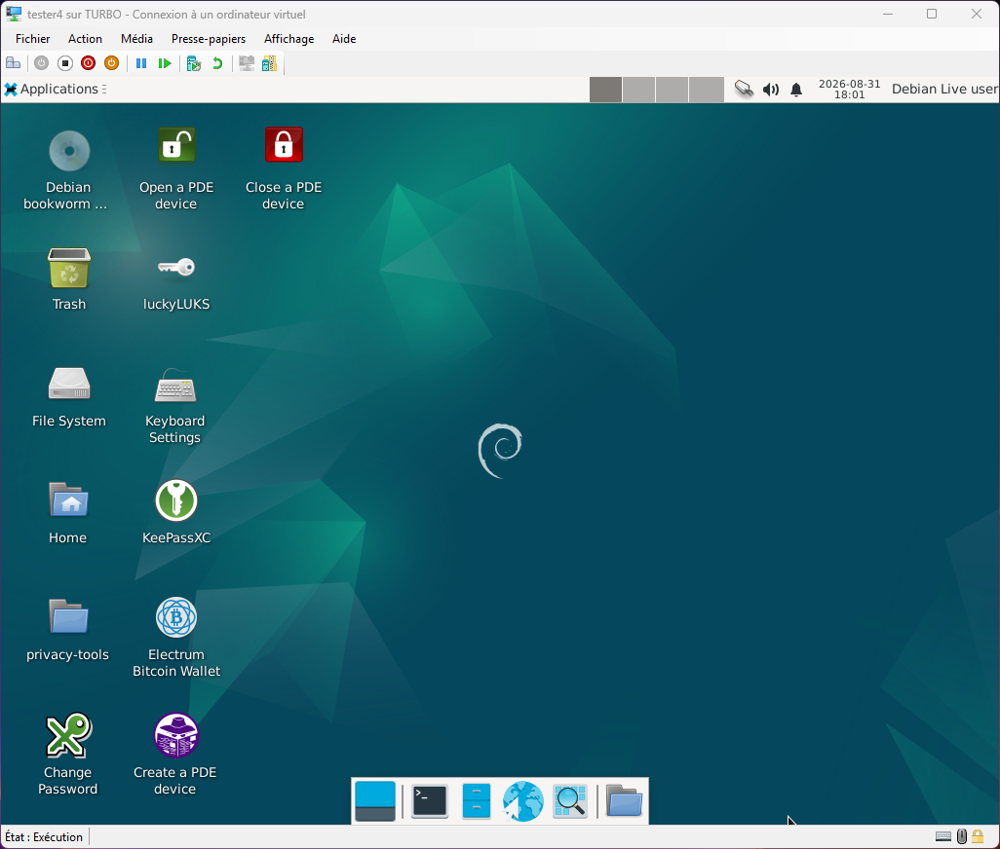
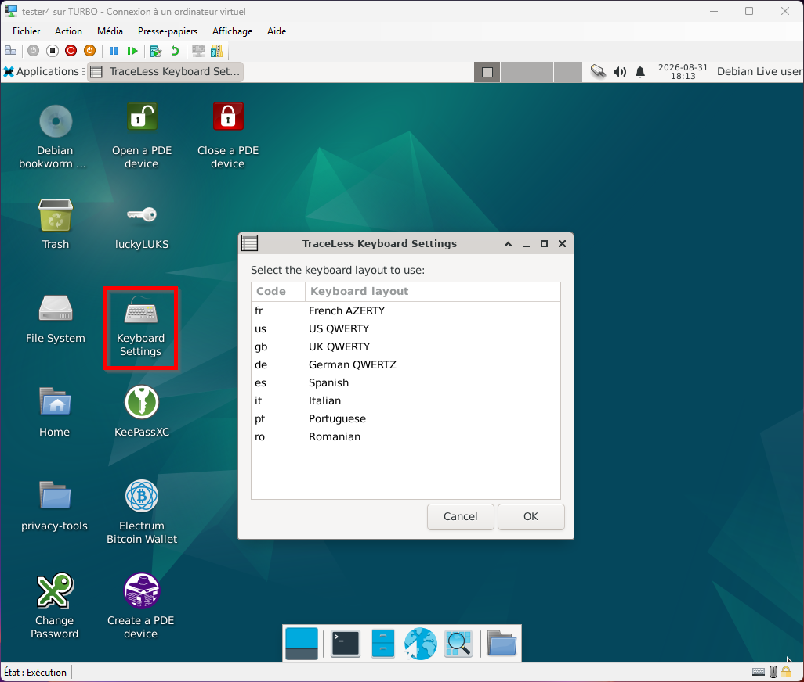
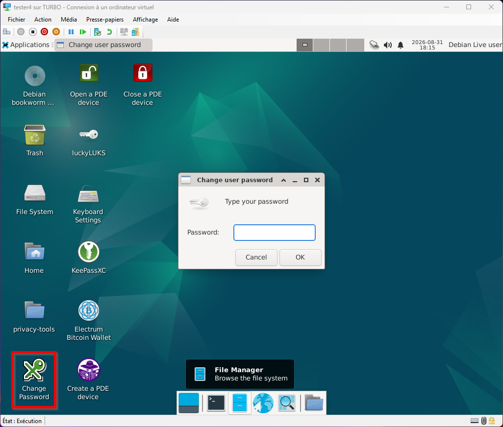

# TraceLess: A Privacy-Focused Operating System That Leaves No Trace

## Overview

There are situations where sensitive data must be handled without leaving recoverable traces on a computer.

Consider the following example:

You need to prepare files for cloud storage. Before uploading them, you encrypt the files locally. Even if the original files are later deleted, remnants may remain on the storage device and could potentially be recovered through forensic analysis. This becomes a concern if the computer is compromised, stolen, sold, or discarded without proper sanitization.

In such scenarios, a safer approach is to work from an operating system that never writes data to persistent storage. Ideally, the system should run entirely in memory while providing all the tools required for encryption, secure communications, and privacy-oriented workflows.

This project demonstrates how to build a customized Debian-based operating system designed to run entirely from a read-only USB drive.

## Key Features

* Runs entirely in RAM.
* Does not require mounting a hard drive.
* Designed for privacy-sensitive operations.
* Includes a curated set of security and productivity tools.

## Requirements

* **USB key**: 16Gb or more.
* **RAM**: 12Gb or more.

## Included Software

* [KeePassXC](https://keepassxc.org/) – Password manager.
* [Cryptsetup](https://gitlab.com/cryptsetup/cryptsetup) – Disk and container encryption utility based on LUKS.
* [GnuPG](https://www.gnupg.org/) – OpenPGP implementation.
* [Luckyluks](https://github.com/jas-per/luckyLUKS): A Linux GUI for creating and (un-)locking encrypted volumes from container files.
* [Age](https://github.com/filosottile/age) – Modern, simple, and secure file encryption tool.
* [OpenSSL](https://www.openssl.org/) – Cryptographic toolkit and SSL/TLS implementation.
* [OpenSSH Client](https://www.openssh.org/) – Secure remote access and file transfer tools.
* [Proton VPN](https://protonvpn.com/) – Privacy-focused VPN service.
* [Firefox ESR](https://www.mozilla.org/firefox/) – Extended Support Release of the Firefox web browser.
* [LibreOffice Writer](https://www.libreoffice.org/) – Open-source word processor.
* [Electrum](https://electrum.org/): Open-source Bitcoin wallet that supports the lightning network.
* [Privacy tools](https://github.com/click-and-shield/privacy-forge):
  * Quickly encrypt and decrypt text using a highly secure algorithm (AES-256 in GCM mode with PBKDF2/SHA-256 key derivation).
  * Quickly encrypt using a public key, and decrypt using a private key.
  * Quickly sign using a private key, and verify using a public key.
  * Encrypt, decrypt, sign, verify, and generate GPG/OpenPGP key pairs entirely in the browser.
  * Share and reconstruct a secret using Shamir's secret sharing algorithm.
  * Create QR codes from text.

## Added Features

<table style="padding:10px">
   <tr>
      <td>
         
      </td>
      <td>
         <b>Create a PDE ([Plausibly Deniable Encrypted](https://en.wikipedia.org/wiki/Deniable_encryption)) device</b>.
         A storage device encrypted with LUKS using a detached header. The encrypted partition occupies the entire device and does not contain the LUKS header, making it difficult to distinguish from random data.
      </td>
   </tr>

   <tr>
      <td>
         
      </td>
      <td>
         <b>Open a PDE device</b>.
      </td>
   </tr>

   <tr>
      <td>
         
      </td>
      <td>
         <b>Close a PDE device</b>.
      </td>
   </tr>

   <tr>
      <td>
         
      </td>
      <td>
         <b>Change the user's password</b>.
         At startups, no authentication is required. However, the session may lock itself after a certain inactivity period. In this case, you need the password for the user `user`:

* **user**: `user`
* **default password**: `live`

The default password may be changed by clicking on this desktop icon.

> Please remember that any configuration persists only until the next reboot!
      </td>
   </tr>

   <tr>
      <td>
         
      </td>
      <td>
         <b>Change the keyboard's configuration</b>.
         The default keyboard's layout is <b>French AZERTY</b>. You can configure the keyboard easily once the OS has booted by clicking on this desktop icon.
      </td>
   </tr>

</table>

## Screenshots

### Overview

### Configuring the keyboard

### Change the user's password

## Extra documentation

* [Building the ISO image](doc/build.md)
* [Testing the ISO image using a VM](doc/testing.md)
* [Create a bootable USB key from the generated ISO file](doc/burning.md)
* [XFCE notes](doc/xfce.md)
