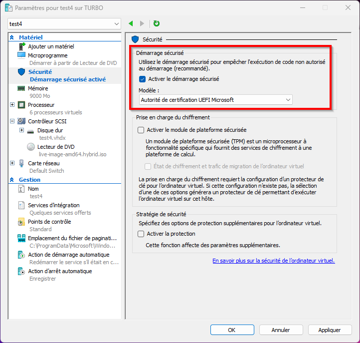

# Testing the generated ISO

## Creating the VM

1. Launch Hyper-V.
2. Create a virtual machine and attach the generated ISO image (`live-image-amd64.hybrid.iso`).
3. Follow the installation instructions available here:

https://www.it-connect.fr/chapitres/hyper-v-installer-debian-linux-dans-une-vm/

For best compatibility, use a Generation 2 virtual machine (UEFI).

Make sure to configure the secured boot as follows:



## Usefull commands

### Getting PowerShell commands related to VMs

```
Get-Command *-VM*
```

### Getting VM status (using Microsoft HYPER-V)

```
Get-VM traceless
```

### Geting the IP address of the VM

#### From the VM

```bash
ip addr
```

If the network interface has no IP address:

```bash
sudo ip addr flush dev eth0
ip addr
sudo dhclient 
ip addr
```

#### From the host (using Microsoft HYPER-V)

```
PS C:\WINDOWS\system32> Get-VMNetworkAdapter -VMName "test20" | Select-Object -ExpandProperty MacAddress
00155D019B1D
PS C:\WINDOWS\system32> arp -a | findstr /i 00-15-5D-01-9B-1D
  172.20.38.83          00-15-5d-01-9b-1d     statique
```

## Geting the IP address of a host running Windows

```
ipconfig
```

Les deux adresses IP ci-dessous sont sur le même réseau, n'est-ce-pas ?

  192.168.8.183/24
  192.168.1.155/24


