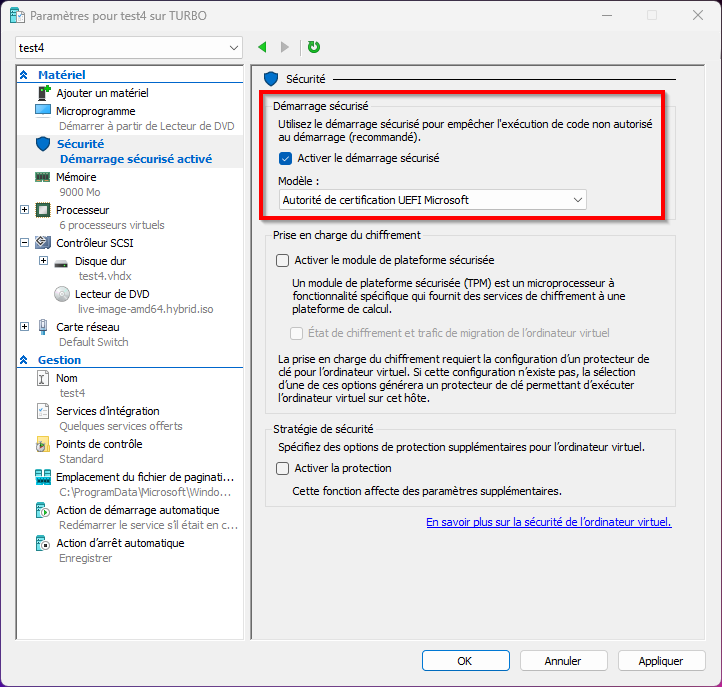
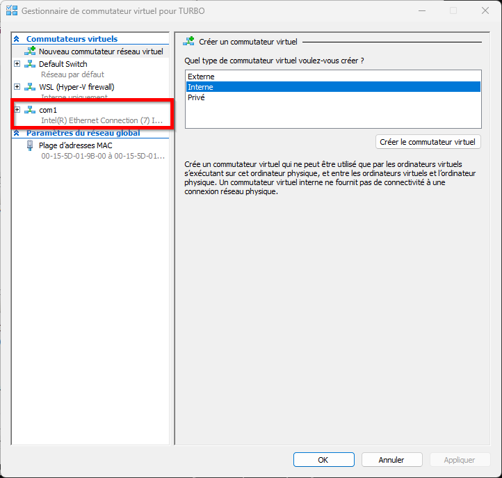
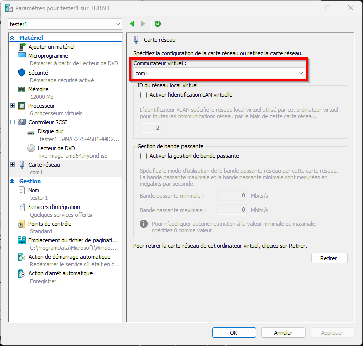

# Testing the generated ISO

## Creating the VM

1. Launch Hyper-V.
2. Create a virtual machine and attach the generated ISO image (`live-image-amd64.hybrid.iso`).
3. Follow the installation instructions available here:

   https://www.it-connect.fr/chapitres/hyper-v-installer-debian-linux-dans-une-vm/

   For best compatibility, use a **Generation 2 virtual machine (UEFI)**.

   Make sure to configure the secured boot as follows:

   

If the VM cannot access the WEB, then:

1. You should create a new virtual switch:

   1. In the **Actions pane**, click **Virtual Switch Manager**.
   2. Under **Create virtual switch**, select **External**.
   3. Click **Create Virtual Switch**.
      Enter a name for the switch, for example: "com1"
   4. Under **Connection type**, select **External network**.
   5. Select the physical network adapter that provides Internet access: the Ethernet adapter, or the Wi-Fi adapter.
   6. Leave **Allow management operating system to share this network adapter** enabled. This allows Windows and the virtual machines to use the same physical adapter.
   7. Click Apply, then OK.

   

2. Connect the Virtual Machine to the Switch:

   1. In **Hyper-V Manager**, select the virtual machine.
   2. In the **Actions pane**, click **Settings**.
   3. Select **Network Adapter**.
   4. In the **Virtual switch drop-down list**, select the external switch created previously (for example, "com1").
   5. Ensure that **Enable virtual LAN identification** is disabled unless VLAN support is specifically required.
   6. Click Apply, then OK.
   7. Start or restart the virtual machine.

  

## Usefull commands

### Getting PowerShell commands related to VMs

```
Get-Command *-VM*
```

### Getting VM status (using Microsoft HYPER-V)

```
Get-VM traceless
```

### Geting the IP address of the VM

#### From the VM

```bash
ip addr
```

If the network interface has no IP address:

```bash
sudo ip addr flush dev eth0
ip addr
sudo dhclient 
ip addr
```

#### From the host (using Microsoft HYPER-V)

Print the network configuration:

```
PS C:\WINDOWS\system32> Get-VMSwitch

Name                   SwitchType NetAdapterInterfaceDescription
----                   ---------- ------------------------------
Default Switch         Internal
WSL (Hyper-V firewall) Internal
```

```
PS C:\WINDOWS\system32> Get-VMNetworkAdapter -VMName "test20" | Select-Object -ExpandProperty MacAddress
00155D019B1D
PS C:\WINDOWS\system32> arp -a | findstr /i 00-15-5D-01-9B-1D
  172.20.38.83          00-15-5d-01-9b-1d     statique
```

## Geting the IP address of a host running Windows

```
ipconfig
```


